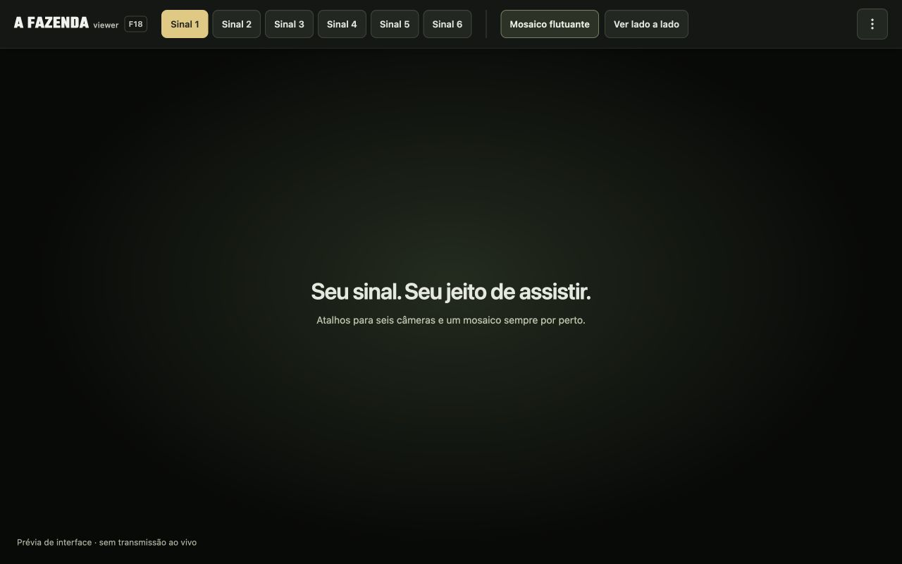

# A Fazenda viewer · F18

Extensão independente e gratuita para acompanhar A Fazenda 18 no RecordPlus, com seis sinais, mosaico flutuante e visualização lado a lado. Sem anúncios ou telemetria da extensão.

Usa os players originais e sua sessão normal do Chrome. Você precisa de sua própria conta do RecordPlus com os direitos necessários. O projeto não é afiliado à RECORD ou ao RecordPlus.

## Instalar ou atualizar

A versão de teste **1.3.1** está disponível no GitHub. A publicação na Chrome Web Store está adiada; ainda não há um link aprovado da loja. Esta versão é específica para **A Fazenda 18**.

1. Baixe e extraia `a-fazenda-viewer-1.3.1.zip` na [versão de teste](https://github.com/jungleBadger/a-fazenda-viewer/releases/tag/v1.3.1-rc.1).
2. Abra `chrome://extensions`. Ative **Modo do desenvolvedor**, clique em **Carregar sem compactação** e selecione a pasta com `manifest.json`. Para atualizar, substitua os arquivos da pasta já instalada pelos do ZIP e clique em **Recarregar**.
3. Feche as janelas antigas do viewer e clique no ícone da extensão para abrir a nova versão.

## Usar

Escolha **Sinal 1–6** ou use as teclas **1–6**. **Mosaico flutuante** prepara a aba do mosaico; espere o vídeo carregar e clique em **Abrir miniplayer** nessa aba. Mantenha-a aberta para alimentar o miniplayer. **Ver lado a lado** mostra os dois players em paralelo.

**Mais opções** (⋮), à direita, reúne os atalhos e o link do GitHub. Você pode desligar as teclas **1–6** e **M** ali; os botões continuam funcionando.

Para deixar mais espaço para o vídeo, ative **Ocultar barra automaticamente** nesse menu. A barra reaparece no topo ou com **Alt + Shift + F** e permanece aberta enquanto você usa os controles. Por padrão, ela fica visível.

[Guia completo de uso](docs/usage.md) · [Suporte no GitHub](https://github.com/jungleBadger/a-fazenda-viewer/issues)

## Sobre o projeto

- [Changelog](CHANGELOG.md)
- [Licença MIT](LICENSE) · [licença da fonte Teko](fonts/OFL.txt)
- [Política de privacidade](docs/privacy-policy.md)
- [Desenvolvimento e verificação](docs/development.md)
- [Revisão de UX/UI e acessibilidade](docs/ux-review.md)
- [Materiais da Chrome Web Store](store/listing.md)
