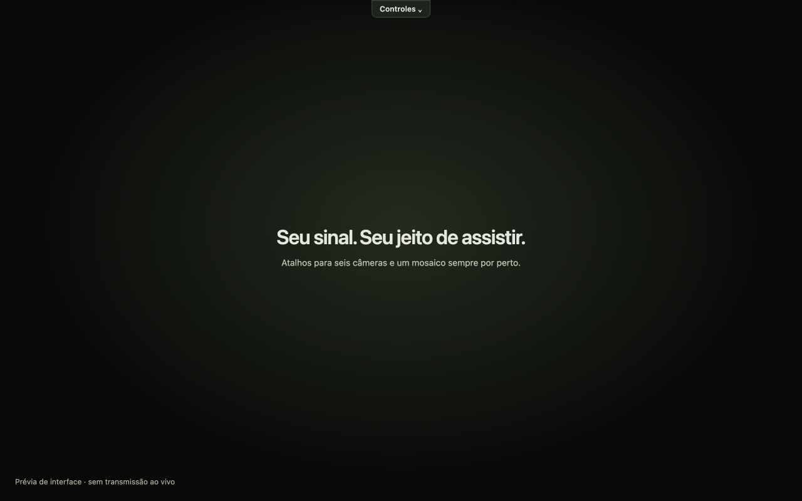

# Guia de uso

## Mosaico flutuante

1. No sinal principal, clique em **Mosaico flutuante** ou pressione **M**. A extensão abre a aba do mosaico na mesma janela, sem diminuir o sinal principal.
2. Espere o vídeo aparecer; clique em Play se necessário.
3. Clique em **Abrir miniplayer** ou pressione **M** na aba do mosaico. O Chrome exige uma ação nessa página para abrir PiP; não é possível prometer abertura automática a partir do sinal principal.
4. O mosaico fica em uma janela de vídeo flutuante, sem som, e a extensão retorna ao sinal principal. Arraste e redimensione o miniplayer pelo próprio Chrome.
5. Use **1–6** na página principal para trocar de sinal. **M** no sinal principal fecha o miniplayer e pausa o mosaico. O X da janela flutuante também atualiza o estado dos controles.

Mantenha a aba do mosaico aberta: ela alimenta o miniplayer. Não é criada uma segunda janela normal do Chrome neste modo. Para reabrir após fechar, repita a ação de abrir na aba do mosaico; a mesma aba é reutilizada.

O PiP de vídeo mostra apenas o vídeo e os controles fornecidos pelo Chrome. Os botões dos seis sinais ficam na página principal. Os atalhos precisam de foco em uma página do viewer; eles não são globais e não funcionam com foco na janela nativa de PiP.

Se o player, o navegador ou a política do site não permitir PiP, a extensão mostra uma explicação e preserva **Ver lado a lado**. Não altera políticas, permissões de reprodução ou `disablePictureInPicture` do vídeo.

## Sinais e atalhos

O botão **Mais opções** (⋮), à direita da barra, reúne a ajuda dos atalhos e o link do projeto no GitHub. Use **Ativar atalhos de teclado** para desligar ou reativar as teclas 1–6 e M; a preferência é salva no dispositivo e vale para as abas do viewer. O menu abre com Enter ou Espaço, permite navegação com Tab e fecha com Escape, devolvendo o foco ao botão.

- **Sinal 1–6** / teclas **1–6**: troca diretamente o sinal principal e conserva o mosaico. Escolher o sinal atual não reinicia o player.
- **M**: no sinal principal, prepara ou fecha o mosaico flutuante; na aba do mosaico, abre ou fecha seu miniplayer.
- **Voltar ao sinal**: retorna ao principal sem abrir PiP. Cancela a preparação de um mosaico ainda não aberto.
- Os atalhos ficam desativados em campos de texto e seletores, durante composição de texto e com Ctrl, Command ou Alt. Segurar a tecla não provoca trocas repetidas.
- Esses atalhos substituem a função original das teclas no player (por exemplo, silenciar com M).
- Os controles originais de reprodução, login e tela cheia continuam no RecordPlus.

## Barra automática

A barra fica visível por padrão. Em **Mais opções**, ative **Ocultar barra automaticamente** para recolhê-la após 2,5 s sem interação. Nesse modo, o player ocupa toda a altura; a barra aparece sobre o vídeo quando você precisa dela, sem mudar o tamanho do player a cada abertura.

- Mova o ponteiro até o topo para mostrar os controles, ou use o botão **Controles**.
- **Alt + Shift + F** mostra a barra e leva o foco ao primeiro sinal. No Mac, Alt corresponde a Option. Esse atalho continua disponível com as teclas 1–6 e M desligadas.
- A barra não recolhe com o ponteiro ou foco dentro dela, com o menu aberto, nem com dicas de PiP ou mensagens da extensão pendentes.
- **Escape** fecha primeiro o menu. Com foco na barra, Escape recolhe os controles e leva o foco ao botão de abertura, quando não há mensagens pendentes.
- Os controles recolhidos saem da ordem de Tab e da árvore de acessibilidade. O botão de abertura continua disponível. A preferência é mantida no dispositivo e vale para as abas do viewer.

## Ver lado a lado

**Ver lado a lado** conserva o modo anterior. Em versões com Split View disponível à extensão, usa a divisão nativa da janela. Nas demais versões, abre duas janelas dedicadas, com o mosaico sem som. **Ocultar lado a lado** pausa e conserva o mosaico, restaurando o tamanho do principal.

É possível alternar entre os dois modos sem criar outro mosaico. A janela original em que você estava navegando não é redimensionada. Fechar a aba principal também fecha a aba do mosaico criada pela extensão.

## Reprodução e acesso

Login, limites de reprodução simultânea e mensagens de permissão são definidos pelo RecordPlus. Na troca do sinal principal, uma cobertura de carregamento dura no máximo 1,8 s ou termina quando o vídeo reproduz. Ela suaviza a mensagem transitória de permissão; erros persistentes continuam visíveis após esse prazo. Não altera a autorização do player.

Para remover, desinstale a extensão em `chrome://extensions`.

[Voltar ao README](../README.md)
